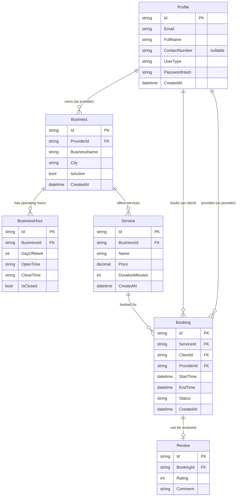

# BookSpot Entity Relationship Diagram

## Database Schema Overview

This ERD represents the DynamoDB-based data model for the BookSpot application, a booking system for service providers and clients.

## Entity Descriptions

### Profile
- **Purpose**: Represents users in the system (both clients and service providers)
- **Key Fields**: 
  - `Email`: Used for authentication and login (required, unique)
  - `FullName`: User's complete name (required)
  - `ContactNumber`: Phone number for contact (optional)
  - `UserType`: Distinguishes between clients and providers
  - `PasswordHash`: Secure password storage using BCrypt

### Business
- **Purpose**: Represents a service provider's business
- **Relationships**: 
  - Owned by a Profile (where UserType = "provider")
  - Contains multiple Services and BusinessHours

### BusinessHour
- **Purpose**: Defines operating hours for each day of the week
- **Key Fields**:
  - `DayOfWeek`: 0-6 representing Sunday-Saturday
  - `OpenTime`/`CloseTime`: String format for time
  - `IsClosed`: Boolean for closed days

### Service
- **Purpose**: Represents individual services offered by a business
- **Key Fields**:
  - `Price`: Decimal pricing
  - `DurationMinutes`: Service duration for scheduling

### Booking
- **Purpose**: Central entity representing appointment bookings
- **Relationships**: 
  - Links Service, Client (Profile), and Provider (Profile)
  - Can have one Review after completion
- **Key Fields**:
  - `Status`: Booking state (pending, confirmed, completed, cancelled)
  - `StartTime`/`EndTime`: Appointment scheduling

### Review
- **Purpose**: Customer feedback for completed bookings
- **Key Fields**:
  - `Rating`: Numeric rating (typically 1-5)
  - `Comment`: Text feedback

## Key Relationships

1. **Profile → Business**: One-to-Many (Providers can own multiple businesses)
2. **Business → Service**: One-to-Many (Businesses offer multiple services)
3. **Business → BusinessHour**: One-to-Many (Operating hours for each day)
4. **Service → Booking**: One-to-Many (Services can be booked multiple times)
5. **Profile → Booking**: Many-to-Many (Clients book services, Providers fulfill them)
6. **Booking → Review**: One-to-One (Each booking can have one review)

## DynamoDB Implementation Notes

- All entities use string-based primary keys (`Id`)
- Foreign key relationships are maintained through string references
- No enforced referential integrity (typical for NoSQL)
- Scan operations used for queries like email lookup in ProfileRepository
- Tables are named in lowercase with underscores (e.g., "business_hours")